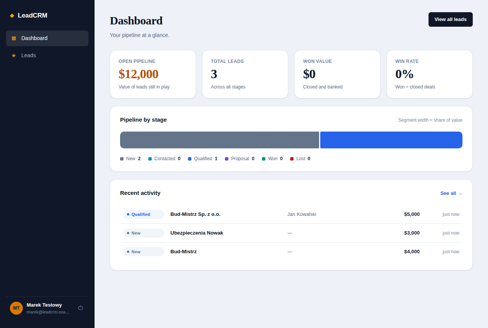

# LeadCRM

A full-stack, multi-user CRM for capturing, qualifying, and tracking sales leads
through a pipeline — from first touch to closed-won. Built as a demonstration of
a complete production-shaped application: authentication, a relational data model,
a REST API, and a polished single-page React front end.



## What it does

- **Secure multi-user accounts.** Register and sign in with JWT access/refresh
  tokens. Every user sees only their own leads — enforced at the query layer.
- **Full lead lifecycle.** Create, edit, filter, search, sort, and paginate leads
  across six pipeline stages (New → Contacted → Qualified → Proposal → Won / Lost).
- **Activity timeline.** Log calls, emails, meetings, and notes on each lead.
  Stage changes are recorded automatically.
- **Pipeline dashboard.** Live stats — open pipeline value, won value, win rate —
  and a proportional pipeline bar showing where value sits by stage.
- **Bulk import.** Paste a JSON array (e.g. exported from a scraper) to import
  many leads in one call.

## Tech stack

**Backend**
- FastAPI (Python) — async REST API with automatic OpenAPI docs
- SQLAlchemy 2.0 — typed ORM models with relationships and cascade deletes
- SQLite — zero-setup persistence (swap `DATABASE_URL` for Postgres in production)
- PyJWT + pwdlib (Argon2) — token auth and modern password hashing
- Pydantic v2 — request/response validation

**Frontend**
- React 18 + Vite — single-page app
- React Router — client-side routing with protected routes
- Hand-built design system — no UI kit; custom components and CSS

## Running locally

You need Python 3.11+ and Node 18+.

### 1. Backend

```bash
cd backend
python -m venv .venv && source .venv/bin/activate   # optional
pip install -r requirements.txt
cp .env.example .env        # optional; a random SECRET_KEY is generated if omitted
uvicorn app.main:app --reload
```

The API runs at `http://localhost:8000`. Interactive docs at `http://localhost:8000/docs`.

### 2. Frontend

```bash
cd frontend
npm install
npm run dev
```

The app runs at `http://localhost:5173` and proxies `/api` to the backend.

Open the app, create an account, and use **Import → Insert sample data** to populate
your first leads.

## Project structure

```
backend/
  app/
    core/          # config, database, security, shared dependencies
    routers/       # auth, leads, dashboard endpoints
    models.py      # SQLAlchemy models (User, Lead, Activity)
    schemas.py     # Pydantic request/response schemas
    main.py        # app factory, CORS, router wiring
frontend/
  src/
    components/    # AppShell, Modal, LeadForm, PipelineBar, UI primitives
    pages/         # AuthPage, Dashboard, Leads, LeadDetail
    lib/           # API client, auth context, constants
```

## API overview

| Method | Path | Description |
| --- | --- | --- |
| POST | `/api/auth/register` | Create an account |
| POST | `/api/auth/login` | Get access + refresh tokens |
| POST | `/api/auth/refresh` | Rotate tokens |
| GET | `/api/auth/me` | Current user |
| GET | `/api/leads` | List leads (search, filter, sort, paginate) |
| POST | `/api/leads` | Create a lead |
| GET | `/api/leads/{id}` | Lead detail with activity history |
| PATCH | `/api/leads/{id}` | Update a lead |
| DELETE | `/api/leads/{id}` | Delete a lead |
| POST | `/api/leads/{id}/activities` | Log an activity |
| POST | `/api/leads/import` | Bulk-import leads |
| GET | `/api/dashboard` | Pipeline stats |

## Notes

- Tables are created automatically on startup. For real deployments, use Alembic
  migrations and set a fixed `SECRET_KEY`.
- The frontend keeps tokens in `localStorage` and refreshes them transparently on
  `401`. For higher-security deployments, consider httpOnly cookies.
